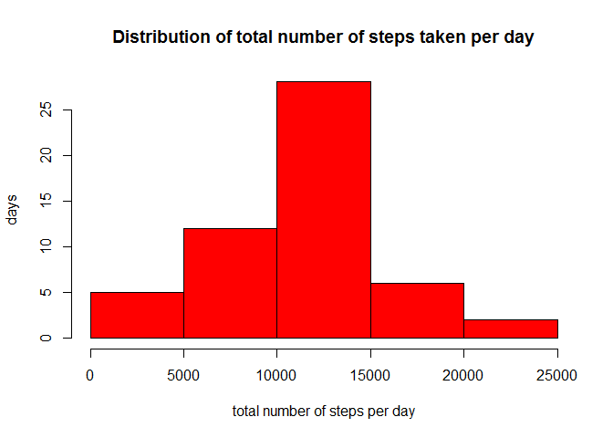

# Reproducible Research: Peer Assessment 1
 
This is the assignment for the first Peer Assessment for Coursera Reproducible Research  
Made by Peter van Gastel  
Date 2015-01-15  
<br>
The assignment is to answer given questions using R and to create a report with Knitr.   
<br>
This assignment makes use of data from a personal activity monitoring device. This device collects data at 5 minute
intervals through out the day. The data consists of two months of data from an anonymous individual collected during
the months of October and November, 2012 and include the number of steps taken in 5 minute intervals each day.
<br>
<br>

## Data

The data for this assignment can be downloaded from the course web site:

* **Dataset**: [Activity monitoring data](https://d396qusza40orc.cloudfront.net/repdata%2Fdata%2Factivity.zip) [52K]  
<br>

The variables included in this dataset are:

* **steps**: Number of steps taking in a 5-minute interval (missing values are coded as `NA`)

* **date**: The date on which the measurement was taken in YYYY-MM-DD format

* **interval**: Identifier for the 5-minute interval in which measurement was taken


The dataset is stored in a comma-separated-value (CSV) file and there are a total of 17,568 observations in this
dataset.
<br>
<br>

## Setting environment and loading librarys
Because I have the Dutch version of Windows I have to change the local time and date format to English.  
And I use ggplot2 for some plots so I have to load the library ggplot2.  
<br>

```r
# Set local time and date format to English
Sys.setlocale("LC_TIME", "English")

# load library ggplot2
library(ggplot2)
```
<br>
 
## Loading and preprocessing the data

I first downloaded the file [activity.zip](https://d396qusza40orc.cloudfront.net/repdata%2Fdata%2Factivity.zip) manualy from the course web site and unzipped it with pkunzip in my workingdirectory.  
Then I read the file in a dataframe with read.csv
<br>

```r
# read the file in dataframe ActData
ActData <- read.csv("activity.csv", sep = ",")
```
<br>
 
## What is mean total number of steps taken per day?

For this part of the assignment I calculate the sum of steps for each date.  
Plot a histogram of the total number of steps taken each day as requested.  
Plot a histogram that shows the distribution.  
Then I calculate the mean and median total steps per day.  
<br>

```r
# create a new dataframe with the sum of steps for each day
SumAllDays <- aggregate(ActData$steps, list(ActData$date), sum)
colnames(SumAllDays) <- c("date", "totalSteps")

# plot histogram with the total number of steps taken each day
barplot(SumAllDays$totalSteps,
        names.arg = SumAllDays$date,
        main = "Total number of steps taken per day",
        col  = "red",
        xlab = "date",
        ylab = "total steps")
```

 

As we can see there are a few days without data.
And some days with a very low number of steps.  
Let's look at the distribution.  
<br>


```r
# plot histogram that shows the distribution.
hist(SumAllDays$totalSteps,
     col  = "red",
     main = "Distribution of total number of steps taken per day",
     xlab = "total number of steps per day",
     ylab = "days")
```

 

<br>
**Q.** What is the mean and median total number of steps taken per day.
<br>


```r
# remove days with no data
SumAllDays <- na.omit(SumAllDays)

# calculate Mean and Median and round result
MeanStepsDay <- round(mean(SumAllDays$totalStep))
MedianStepsDay <- round(median(SumAllDays$totalStep))
```


```
The mean total number of steps taken per day is: 10766
```

```
The median total number of steps taken per day is: 10765
```
<br>  
 
## What is the average daily activity pattern?
For this question I calculate the mean of steps for each interval and show the results in a plot.   
<br>

```r
# remove days with no data
ActDataNNa <- na.omit(ActData)

# create a new dataframe with the Mean of steps for interval
MeanStepsInterval <- aggregate(ActDataNNa$steps, list(ActDataNNa$interval), mean)
colnames(MeanStepsInterval) <- c("interval", "steps")

# plot the average daily activity pattern
PlotData <- MeanStepsInterval
P <- ggplot(PlotData, aes(x = interval, 
                          y = steps)) 
P <- P + geom_area(fill = "red", colour = "black", alpha = 0.6)
P <- P + labs(title = "Average daily activity pattern", 
                  x = "time (5-minute interval)",
                  y = "steps")
P <- P + theme_bw()
P <- P + theme(plot.title = element_text(size = rel(2), colour = "black"))
P <- P + theme(axis.text  = element_text(size = 14),
               axis.title = element_text(size = 14, face = "bold")) 
print(P)
```

 

<br>
**Q.** Which 5-minute interval, on average across all the days in the dataset, contains the maximum number of steps?
<br>

```r
# which 5-minute interval, on average across all the days in the dataset, contains the maximum number of steps?
MaxSteps <- max(MeanStepsInterval$steps)
MaxInterval <- MeanStepsInterval[(MeanStepsInterval$steps == MaxSteps),"interval"]
```


```
The interval with maximum number of steps is: 835
```

```
The maximum number of steps is: 206
```
<br>

## Imputing missing values
**Q.** What is the total number of missing values (rows) in the dataset. 
<br>


```r
# calculate and report the total number of missing values (rows with NA) in the dataset
MissingVal <- sum(!complete.cases(ActData))
```


```
The total number of missing values (rows) in the dataset is: 2304
```
<br>

Next I insert a number of steps in all of the missing values in the dataset and create a new dataset.
I will use the above calculated means for the 5-minute intervals as input for the missing values.


```r
# create a new dataset that is equal to the original dataset but with the missing data filled in 
# copy Activity dataframe to ActData2 
ActData2 <- ActData

# identify rows with missing steps
MissingSteps <- is.na(ActData2$steps)

# create a fillervector with calculated means for the 5-minute intervals per day (dataframe contains 61 days)
Stepfiller <- rep(MeanStepsInterval$steps, 61) 

# replace NAs in steps with calculated means for the 5-minute intervals
ActData2$steps[MissingSteps] <- round(Stepfiller[MissingSteps])
```
<br>

Then I plot a new histogram of the total number of steps taken each day and calculate the new mean and median total number of steps taken per day. 


```r
# create a new dataframe with the sum of steps for each day
SumAllDays2 <- aggregate(ActData2$steps, list(ActData2$date), sum)
colnames(SumAllDays2) <- c("date", "totalSteps")

# plot histogram with the total number of steps taken each day
barplot(SumAllDays2$totalSteps,
        names.arg = SumAllDays2$date,
        main = "Total number of steps taken per day",
        col  = "red",
        xlab = "date",
        ylab = "total steps")
```

 

As we can see there are a no more days without data. But still some days with a very low number of steps.  

**Q.** Do these values differ from the estimates from the first part of the assignment? What is the impact of imputing missing data on the estimates of the total daily number of steps?


```r
# calculate mean and round result
MeanStepsDay2<- round(mean(SumAllDays2$totalStep))
MedianStepsDay2 <- round(median(SumAllDays2$totalStep))
```


```
The mean total number of steps taken per day was: 10766 and is now: 10766
```

```
The median total number of steps taken per day was: 10765 and is now: 10762
```

As we can see the new median differs slightly from the first value but the mean is still the same.  
The explanation is that I use rounded values as filler for the steps with NA.  
If I don't use rounded numbers than the median would be closer to the mean.  
<br>

## Are there differences in activity patterns between weekdays and weekends?
For this part I need to create a new factor variable in the dataset with two levels - "weekday" and "weekend" indicating whether a given date is a weekday or weekend day.  
And make a panel plot containing a time series plot of the 5-minute interval (x-axis) and the average number of steps taken, averaged across all weekday days or weekend days (y-axis)  
<br>

```r
# Create a new factor variable in the dataset with two levels -- "weekday" and "weekend" 
# indicating whether a given date is a weekday or weekend day.

# Define weekend days
weekend <- c("Saturday", "Sunday")

# Define a function to determine whether the day is a weekend or weekday
WtKindOfDay <- function(date) {
    if (weekdays(as.Date(date)) %in% weekend) {"weekend"}
    else {"weekday"}
}

# Apply function on dataframe ActData2 and create a new factor variable
ActData2$KindOfDay <- sapply(ActData2$date, WtKindOfDay)
ActData2$KindOfDay <- as.factor(ActData2$KindOfDay)


# create a new dataframe with the mean of steps for interval
MeanStepsInterval2 <- aggregate(ActData2$steps, list(ActData2$KindOfDay, ActData2$interval), mean)
colnames(MeanStepsInterval2) <- c("KindOfDay", "interval", "steps")

# plot Average daily activity pattern for weekdays and weekend
PlotData <- MeanStepsInterval2
P <- ggplot(PlotData, aes(x = interval, y = steps)) 
P <- P + geom_area(fill = "red", colour = "black", alpha = 0.6)
P <- P + facet_wrap(~ KindOfDay, nrow=2, ncol=1)
P <- P + labs(title = "Average daily activity pattern for weekdays and weekend", 
                  x = "time (5-minute interval)",
                  y = "number of steps")
P <- P + theme_bw()
print(P)
```

 
<br>

As we can see, there is a clear difference between the activity pattern for weekdays and weekends.  
On a weekday activity starts earlier and has a higher peak in the morning.  
On weekends the activity starts later and there is more activity during the day.
